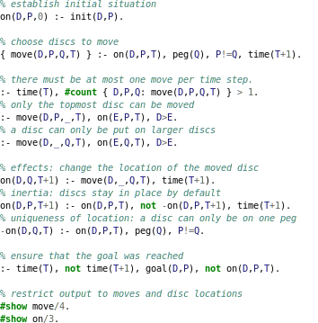

# pygments-clingo

This is a syntax highlighting plugin for pygments to highlight clingo source
files.

Currently, not the whole language is covered but only my current needs. Please
open an issue to request features.

# Example

## Installing 

The package can either be installed using setuptools:

    python setup.py install --user

or there is also a pip package available:

    python -m pip install pygments_clingo
